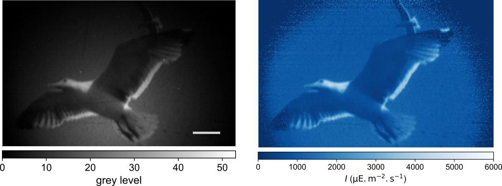
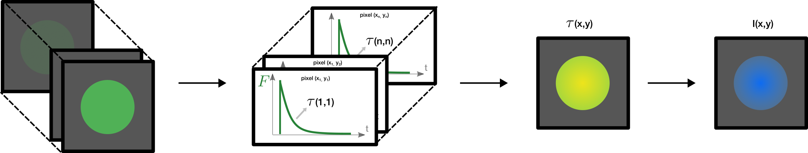
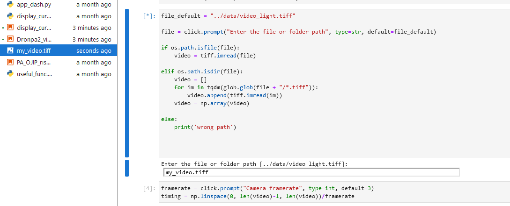
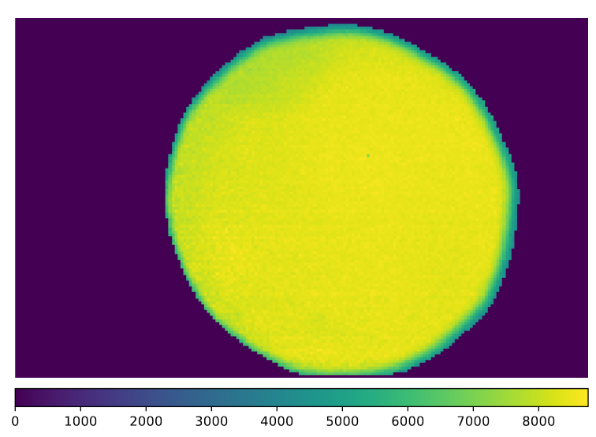
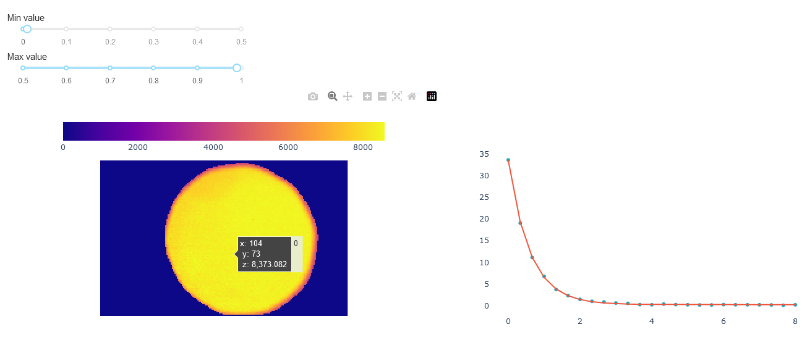

# Fluorescence to measure light intensity

## Summary
The manuscript XXX(to complete) describes methods to calibrate the intensity of a light source using various actinometers, and describe how to implement the protocols.

 This repository contains an example code that can be run online to analyze a calibration video using Dronpa-2. The code inputs the video and performs a pixel-per-pixel fit of a monoexponential. It maps a time constant associated to the time evolution of the fluorescence to each pixel in the image. The kinetic parameter $\sigma_{\lambda}$ allows to convert the time-constant map into an intensity map using the equation: $I(x,y) = \frac{1}{\sigma_{\lambda} \tau(x,y)}$.  

The repository also contains an app to visualize the time-evolution pixel-per-pixel by hovering the mouse over the image. 

**Input**: tiff video or folder with tiff images. (can be adapted to image set Python can handle)  
**Output**: 2D map of the light intensity (.csv/.pdf)
**Method**: pixel-per-pixel mono-exponential fit  

## Start

You can clone the repository to use the codes locally or launch it online with Binder. 

To launch Binder: click 

To install locally: 
The requirement.txt file is in the Binder folder.

## Usage

Open the jupyter notebook **Notebooks/Dronpa2_video.ipynb**

*To execute a cell:* select the cell and press Shift+Enter to execute each cell.  

*Query bar:* enter the value and press Enter **or** press Enter to use the default value.

Start by testing the video provided in the repository to discover the code. Execute the cells and press Enter for all the queries, the default values are optimal for the video provided. 

To test the code with your own video, drag-and-drop it in the interface and type the file name in the query. 

Follow the instructions in the notebook for the next queries. The $\sigma$ value corresponds to $\lambda_{exc} = 470$ nm.

## Results

The outputs are saved in the folder "images" and you can download them. The units are in $µE/m²/s$. 

## Explore

To visualize the time evolution and fits for each pixel, execute cell-by-cell the code **Notebooks/display_curves.ipynb**

##### License

Alienor134/light_calibration is licensed under the GNU General Public License v3.0