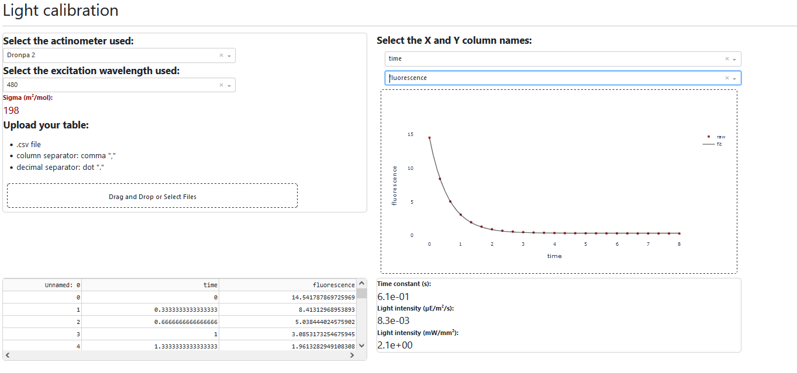

# Light calibration with a chemical actinometer.

Download the executable files and the associated data in the [release page]()

1. Once the fluorescence curve recorded, save it as .csv file (separator: comma, decimal: point). If you don’t have a curve but want to try the app, use the Dronpa2_video.csv provided in the "data" folder of .zip (average per frame).
2. Double click the executable file get_intensity.exe  
3. Open the address http://127.0.0.1:8050 on a web browser of your choice.  
4. Select the chemical and excitation wavelength used: it will display the associated sigma value.  
5. Drag-and-drop your .csv file.
6. Select the X and Y column names (you may need to click twice). An animation shows-up while the fit is being performed.  
7. The graph shows up with the monoexponential fit.   
8. The tau value as well as the intensity values are displayed on the left. The error is expected to be 20%.

